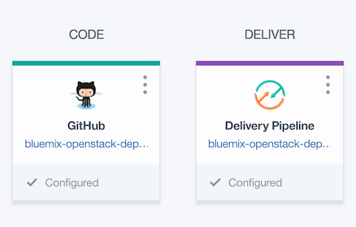
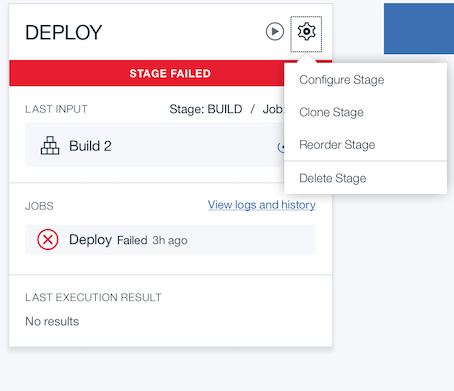
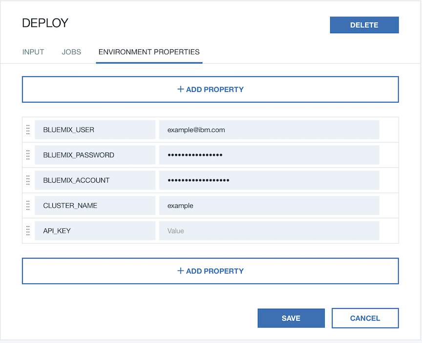
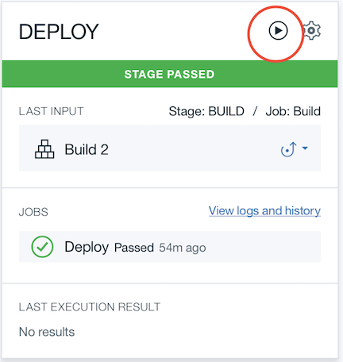

# Toolchain Instructions

> Note: This toolchain instructions is based on this [tutorial](https://developer.ibm.com/recipes/tutorials/deploy-kubernetes-pods-to-the-bluemix-container-service-using-devops-pipelines).

1. Click the **Deploy to Bluemix** button to fork the repo into your GitHub account.

2. If you have not authenticated to GitHub you will see an Authorize button.

3. Once the repository is forked, you will be taken to the Bluemix Continuous Delivery toolchain setup. This toolchain has been defined by the template in the sample repository.

> Note: If you already forked that project, please change your **repository type** to *clone* or *existing*.

4. Click the Create button. This will generate a toolchain that looks like the following:

5. Select the Delivery Pipeline tile from the toolchain view to open the pipeline stages view.

6. The pipeline executes immediately after being created. The Deploy stage will fail on the first run because we are missing your account information for authentication. Click on the gear at the top right corner of the Deploy stage to select Configure Stage.

7. Set the following environment properties

    BLUEMIX_USER – your Bluemix user ID.
    
    BLUEMIX_PASSWORD – your Bluemix password.
    
    BLUEMIX_ACCOUNT – The GUID of the Bluemix account where you created the cluster. Retrieve it with `bx iam accounts`.
    
    CLUSTER_NAME – Your cluster name. Retrieve it with `bx cs clusters`. 

    API_KEY (Optional) - API_KEY is for login to your account. It is recommended for **Federated ID** since Federated ID can't login with Bluemix user and password via Bluemix CLI. You can obtain your API_KEY via https://console.ng.bluemix.net/docs/containers/cs_troubleshoot.html#cs_federated_id

> Note: **Federated ID** means your organization uses a federated identity to authenticate with Bluemix.
   

8. Run the Deploy stage using the Run Stage button at the top righthand side of the stage’s card. This time the Deploy stage will succeed and the application will be deployed.
    

9. Click **View logs and history** of the Deploy stage to find the URL of the application.

10. Congratulation, now you can click the URL link to load the application in your browser. Note it takes a few seconds from the time the pods deploy until they are ready to serve requests.